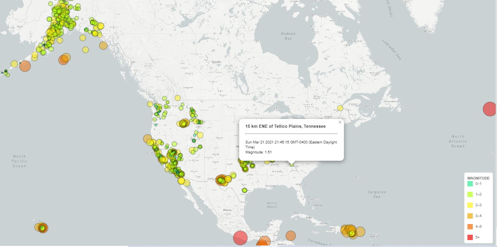

# Visualizing Earthquakes with Leaflet
Used geojson API from the USGS to display world-wide earthquake data from the past week (3/14/21-3/21/21)

### Process
1. **Data**

   

   The USGS provides earthquake data in a number of different formats, updated every 5 minutes. Visited the [USGS GeoJSON Feed](http://earthquake.usgs.gov/earthquakes/feed/v1.0/geojson.php) and analyzed earthquake data from the past seven days.  

   

2. **Map includes:**

  * Markers at the locations of the earthquakes 
  * Marker sizes reflect the magnitude in both radius and color
  * Popups provide additional information about the earthquake when a marker is clicked.
  * A legend that provides context for map data.

